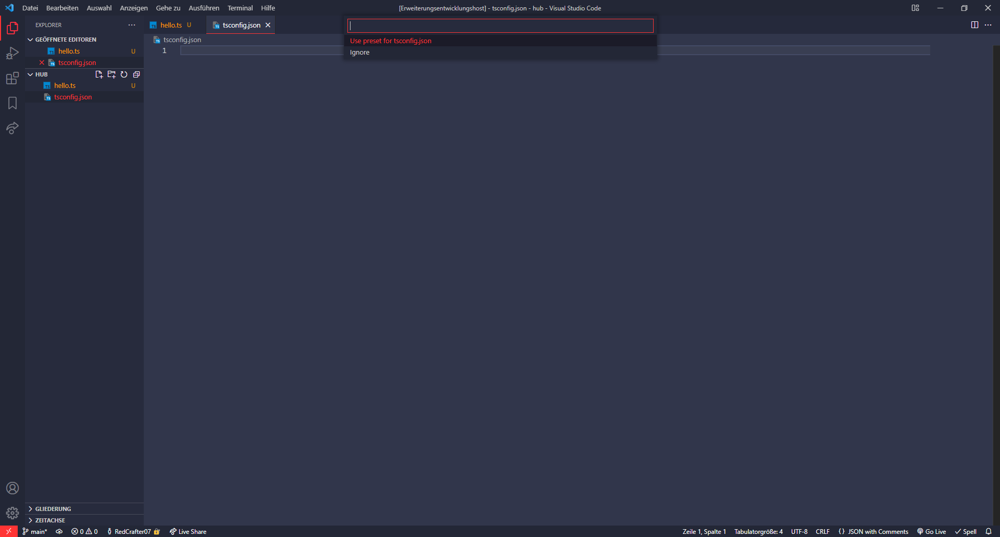

# File Presets

Kinda self explanatory... An extension which provides file presets in a simple way

## Features

This extension will ask you if you want to apply a preset when a file is created. It's just that simple!

## Extension Settings

Some settings will come soon, so stay tuned :)

## Known Issues

No issues found yet!

## Release Notes

### 0.0.1

Initial release of file-presets with some basic features and three preset files
